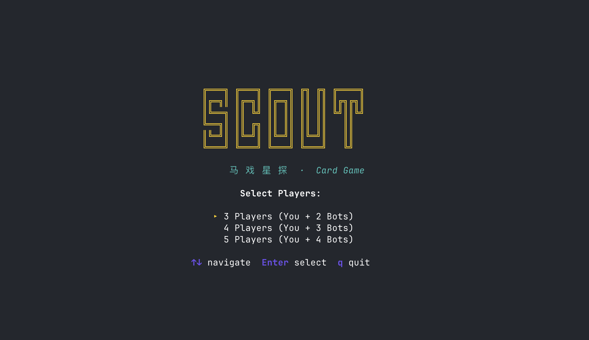
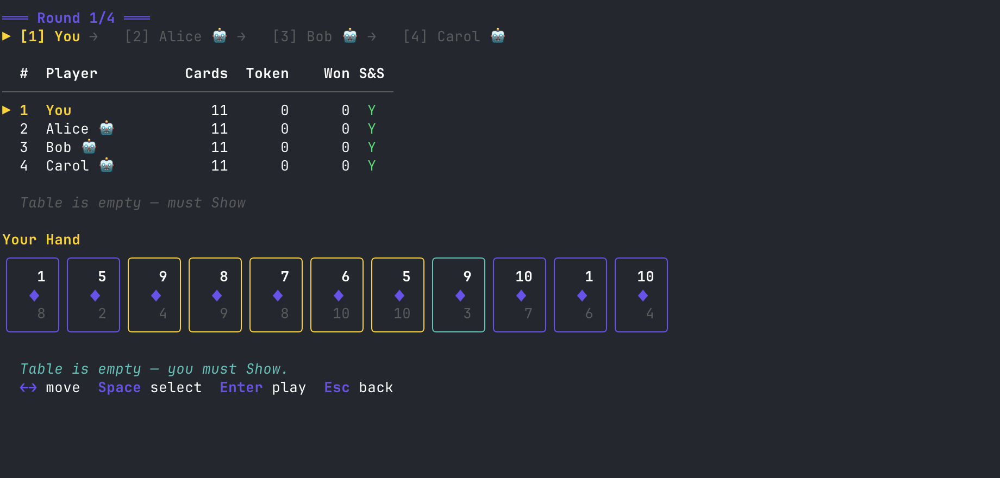

# Scout CLI

A terminal-based implementation of **Scout** (aka *SCOUT!*), the award-winning card game designed by Kei Kajino.

Play against AI opponents right in your terminal with a colorful TUI powered by [Bubble Tea](https://github.com/charmbracelet/bubbletea).

## Screenshots

| Menu | In-Game |
|------|---------|
|  |  |

## Install

```bash
go install github.com/daghlny/scout_cli@latest
```

Then run:

```bash
scout_cli
```

## Features

- 3-5 player games (you vs AI bots)
- Full Scout rules: double-sided cards, Show / Scout / Scout & Show actions
- Greedy and Random AI strategies
- Colorful card rendering in terminal
- Multi-round scoring with final leaderboard

## Game Rules

Scout uses 45 unique double-sided cards (each with two different numbers 1-10). Cards in your hand **cannot be rearranged** — you can only insert new cards via scouting. On your turn, choose one action:

- **Show**: Play adjacent cards from your hand that beat the table combo
- **Scout**: Take a card from either end of the table combo and insert it into your hand
- **Scout & Show**: Do both (once per round)

For full rules, see: https://boardgamegeek.com/boardgame/291453/scout

---

# Scout CLI (中文)

**Scout**（马戏星探）的终端命令行版本，基于 [Bubble Tea](https://github.com/charmbracelet/bubbletea) 构建。

## 游戏截图

| 主菜单 | 游戏进行中 |
|-------|----------|
|  |  |

## 安装

```bash
go install github.com/daghlny/scout_cli@latest
```

运行：

```bash
scout_cli
```

## 功能

- 支持 3-5 人游戏（你 vs AI 对手）
- 完整的 Scout 规则：双面牌、出牌 / 招募 / 双重行动
- 贪心和随机两种 AI 策略
- 终端内彩色扑克牌渲染
- 多轮计分与最终排行榜

## 游戏规则

Scout 使用 45 张双面牌（每张牌正反两面各有一个 1-10 的数字）。手牌**不可重新排列**，只能通过招募插入新牌。每回合选择一个行动：

- **出牌（Show）**：打出手中相邻的牌组合，必须强过桌面上的牌
- **招募（Scout）**：从桌面牌组的左端或右端取一张牌插入手中
- **双重行动（Scout & Show）**：先招募再出牌（每轮限一次）

完整规则参见：https://boardgamegeek.com/boardgame/291453/scout
